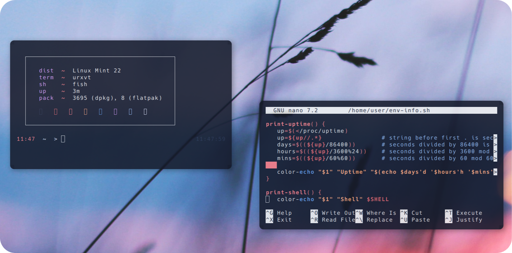
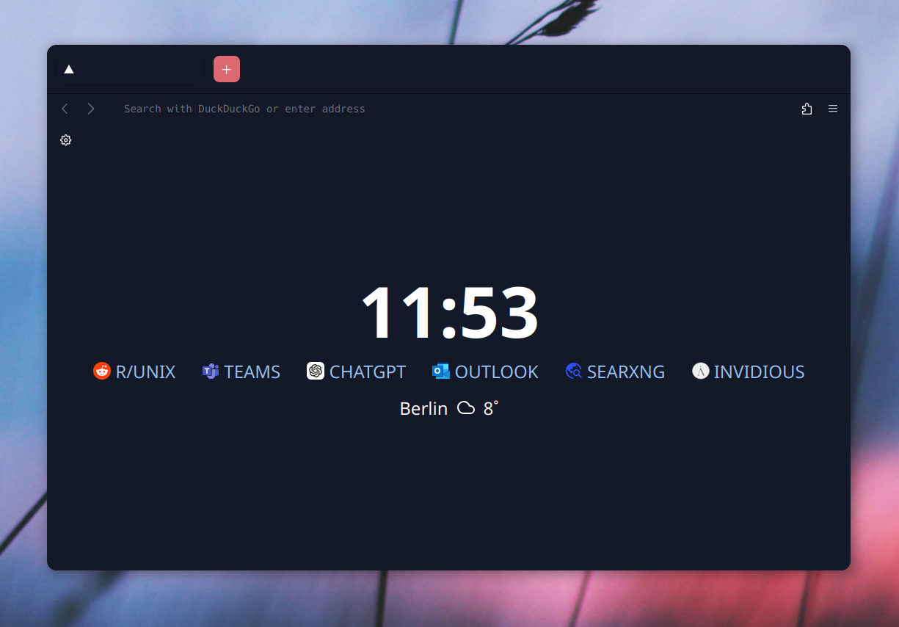
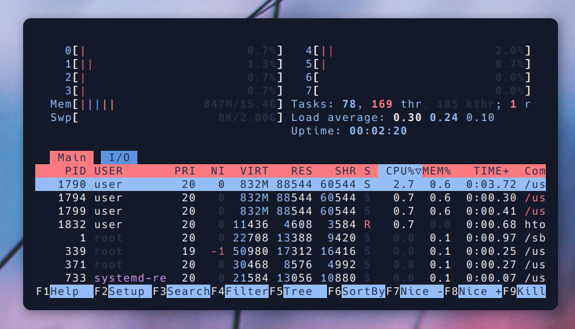

# 🚀 𝕚𝟛-𝕊𝕖𝕥𝕦𝕡 🚀
> **Website**: [i3 Window Manager](https://i3wm.org/)

## ⚙️ Features
<div style="display: flex; align-items: center;">
  <div style="flex: 1; padding-right: 20px;">
    <ul>
      <li>🖥️ <strong>i3 Window Manager</strong> - For a lightweight and efficient, tiling window workflow</li>
      <li>🐟 <strong>Fish Shell</strong> - User-friendly and powerful shell with <a href="https://github.com/oh-my-fish/oh-my-fish">Oh My Fish</a> customization</li>
      <li>💻 <strong>URxvt Terminal</strong> - Compiled from source for a minimalist, efficient experience</li>
      <li>🎨 <strong>Customization</strong> - A fully tailored environment designed for my workflow and aesthetic preferences</li>
      <li>🛠️ <strong>Hands-On Learning</strong> - Building everything from source helps me understand Linux in-depth</li>
    </ul>
  </div>
  <div style="flex: 1;">
    
  </div>
</div>

---

## 📑 Table of Contents

- [🚀 Features](#features)
- [📥 Installation Guide](#installation-guide)
- [🛠️ Dependencies](#dependencies)
- [🔑 Key Bindings](#key-bindings)
- [🌐 Optimized Firefox](#optimized-firefox)
- [📸 Showcase](#showcase)
- [🖼️ Wallpapers](#wallpapers)

---
<div style="display: flex; align-items: center; margin-bottom: 40px;">
  <div style="flex: 1; padding-right: 20px;">
    <p><strong>🌐 Optimized Firefox</strong></p>
    <p>Firefox is my browser of choice, optimized for a <strong>clean design</strong> and <strong>easy usability</strong>. I've customized it to create a <strong>streamlined, intuitive browsing experience</strong>, focusing on simplicity and efficiency. With this setup, Firefox provides a smooth, clutter-free interface.</p>
  </div>
  <div style="flex: 1;">
    
  </div>
</div>

---

<div style="display: flex; align-items: center; margin-bottom: 40px;">
  <div style="flex: 1; padding-right: 20px;">
    <p><strong>🚀 Resource Efficiency</strong></p>
    <p>Optimized for performance and minimal resource usage. On average, my setup consumes between <strong>250 MB and 400 MB of RAM</strong>, depending on the installed packages and background services. This lightweight configuration maximizes system resources for essential tasks and keeps everything running smoothly.</p>
  </div>
  <div style="flex: 1;">
    
  </div>
</div>

---
### 🔑 Key Bindings

#### 📱 **Applications**

- **$mod+q** – Close window  
- **$mod+Return** – Open terminal (URxvt)  
- **$mod+f** – Launch Firefox  
- **$mod+r** – Run dmenu  
- **$mod+e** – Open file manager (PCManFM)  
- **$mod+c** – Launch Visual Studio Code (Codium)  
- **$mod+p** – Screenshot (selection to clipboard)  
- **$mod+Shift+p** – Screenshot (save to Pictures)  
- **$mod+Escape** – Lock screen (slock)

#### 🔊 **Audio Controls**

- **XF86AudioRaiseVolume** – Volume up  
- **XF86AudioLowerVolume** – Volume down  
- **XF86AudioMute** – Toggle mute

#### 💡 **Brightness Controls**

- **XF86MonBrightnessDown** – Decrease screen brightness  
- **XF86MonBrightnessUp** – Increase screen brightness  
- **XF86KbdBrightnessDown** – Decrease keyboard backlight  
- **XF86KbdBrightnessUp** – Increase keyboard backlight

#### ⚙️ **Miscellaneous**

- **$mod+Shift+c** – Reload i3 configuration  
- **$mod+Shift+e** – Exit i3 session

---

## 📦 Dependencies


**Arch Linux 🔷**

To install the necessary dependencies on Arch Linux, run:

```sudo pacman -S neofetch rxvt-unicode tint2 picom fish i3```


**Debian ❣️ - (Ubuntu 🍊 - Mint 🍏)**

For Debian-based distributions, use the following command:


```sudo apt install neofetch rxvt-unicode tint2 fish picom i3```

**Gentoo 🧼**

On Gentoo, you can install the required packages using:


```root # emerge --ask app-misc/neofetch x11-terms/rxvt-unicode x11-misc/tint2 x11-wm/i3 x11-misc/picom```

 > Fish Shell Wiki
    (https://wiki.gentoo.org/wiki/Fish)


**OpenSUSE 🦎**

For OpenSUSE distribution, use the following command:


```sudo zypper install neofetch rxvt-unicode fish tint2 picom i3```


## 📥 Installation Guide

To set up this i3 environment, follow the steps below. Make sure you have the necessary dependencies installed for your distribution (refer to the **Dependencies** section).

### 1. Clone the Repository
First, clone the repository containing my personal i3 setup:

```bash
git clone https://github.com/user7210unix/personal-i3-Setup.git

