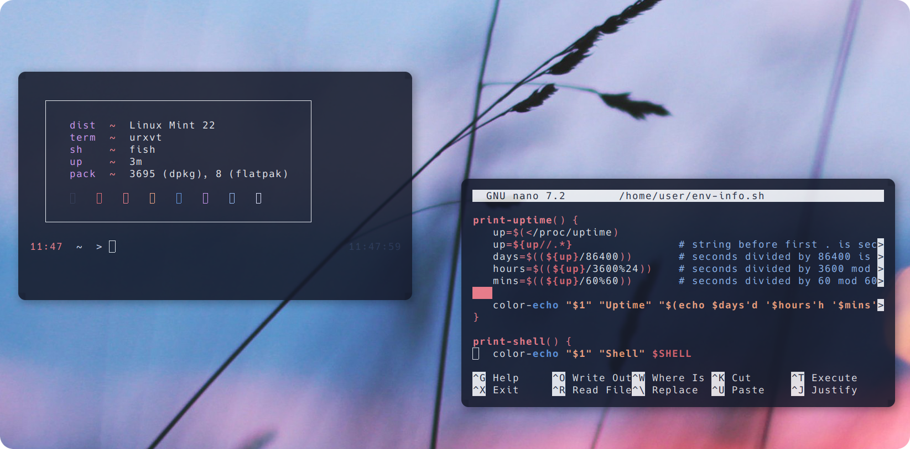

# personal-i3-Setup
This is my Setup with i3 and fish and many other interesting things!


**Features**

    Lightweight and responsive window management
    Custom keybindings for quick navigation
    Aesthetic design with a focus on usability




## Dependencies

**Arch Linux 🔷**

To install the necessary dependencies on Arch Linux, run:

```sudo pacman -S neofetch rxvt-unicode tint2 picom i3```

**Debian ❣️ - (Ubuntu 🍊 - Mint 🍏)**

For Debian-based distributions, use the following command:


```sudo apt install neofetch rxvt-unicode tint2 picom i3```

**Gentoo 🧼**

On Gentoo, you can install the required packages using:


```root # emerge --ask app-misc/neofetch x11-terms/rxvt-unicode x11-misc/tint2 x11-wm/i3 x11-misc/picom```


**OpenSUSE 🦎**

For OpenSUSE distribution, use the following command:


```sudo zypper install neofetch rxvt-unicode tint2 picom i3```


**Instalation:**

```git clone https://github.com/user7210unix/personal-i3-Setup.git```

```cd personal-i3-Setup```
