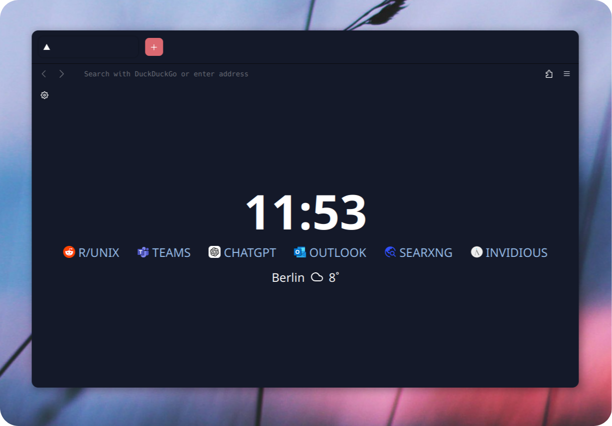
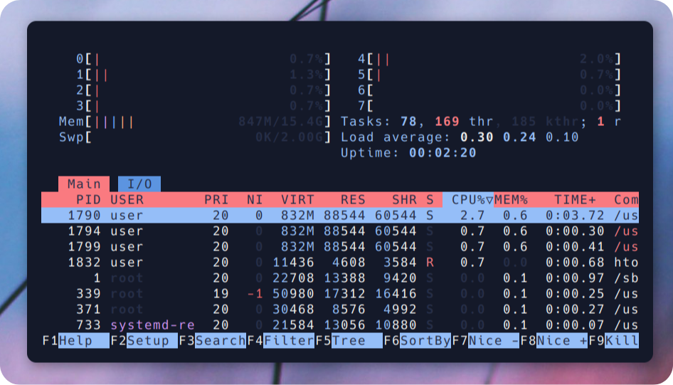

# 🚀 𝕚𝟛-𝕊𝕖𝕥𝕦𝕡 🚀
> **Website**: [i3 Window Manager](https://i3wm.org/)

## ⚙️ Features
<div style="display: flex; align-items: center;">
  <div style="flex: 1; padding-right: 20px;">
    <ul>
      <li>🖥️ <strong>i3 Window Manager</strong> - For a lightweight and efficient, tiling window workflow</li>
      <li>🐟 <strong>Fish Shell</strong> - User-friendly and powerful shell with <a href="https://github.com/oh-my-fish/oh-my-fish">Oh My Fish</a> customization</li>
      <li>💻 <strong>URxvt Terminal</strong> - Compiled from source for a minimalist, efficient experience</li>
      <li>🎨 <strong>Customization</strong> - A fully tailored environment designed for my workflow and aesthetic preferences</li>
      <li>🛠️ <strong>Hands-On Learning</strong> - Building everything from source helps me understand Linux in-depth</li>
    </ul>
  </div>
  <div style="flex: 1;">
    
  </div>
</div>

---
### 🌐 **Optimized Firefox**  
Firefox is my browser of choice, optimized for a **clean design** and **easy usability**. I've customized it to create a **streamlined, intuitive browsing experience**, focusing on simplicity and efficiency. With this setup, Firefox provides a smooth, clutter-free interface.

<p align="center">
  
</p>

---

- 🚀 **Resource Efficiency** - Optimized for performance and minimal resource usage
    - On average, my setup consumes between **250 MB and 400 MB of RAM**, depending on the installed packages and background services. This lightweight configuration maximizes system resources for essential tasks and keeps everything running smoothly.
  
   <p align="center">
  
</p>

---

## 📦 Dependencies


**Arch Linux 🔷**

To install the necessary dependencies on Arch Linux, run:

```sudo pacman -S neofetch rxvt-unicode tint2 picom fish i3```


**Debian ❣️ - (Ubuntu 🍊 - Mint 🍏)**

For Debian-based distributions, use the following command:


```sudo apt install neofetch rxvt-unicode tint2 fish picom i3```

**Gentoo 🧼**

On Gentoo, you can install the required packages using:


```root # emerge --ask app-misc/neofetch x11-terms/rxvt-unicode x11-misc/tint2 x11-wm/i3 x11-misc/picom```

 > Fish Shell Wiki
    (https://wiki.gentoo.org/wiki/Fish)


**OpenSUSE 🦎**

For OpenSUSE distribution, use the following command:


```sudo zypper install neofetch rxvt-unicode fish tint2 picom i3```


**Instalation:**

```git clone https://github.com/user7210unix/personal-i3-Setup.git```

```cd personal-i3-Setup```
``cd dmenu``
``sudo make clean install``
``cd``
``cd config``
